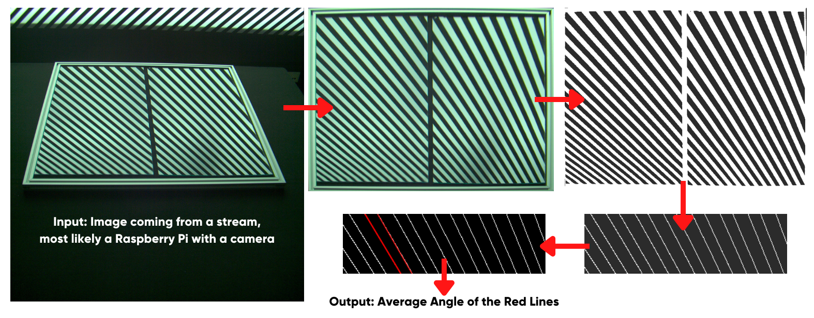

# Image Processing Method of Quality Control in Mirror Production
 



## Description

This script introduces an image processing algorithm which detects reflection lines on 
a mirror to find structural faults (such as cambering, deorientiaton, etc.). The algorithm
can use its input stream from only one camera, and the camera's positioning is not that important.

The algorithm relies on reflecting uniformed sloped lines into a mirror which will be
tested. Due to the camera and environment settings, we have set the default "line detection"
amount for calculating average slope as two. For desire of more accurate average angles,
please update the minimum line detection amount to an increased number.

* **Tile structure analysis**: It allows you to define enclosed areas to find average
angles for each-area individually.
* **Debug and log support**: Within the debug feature, you can see the chances made in each
step of the algorithm both as text, and images.
* **High FPS**: The algorithm operates on 30-40FPS on average. Thanks to its easy-to-understand
mechanism, the FPS can be increased easily with small adjustments. 

## Usage


[TODO: Detailed usage]
Nam malesuada egestas eros, vehicula varius lorem auctor eu. Nunc dolor nulla, elementum 
quis sem quis, ultricies elementum nibh. Donec auctor commodo odio lacinia egestas. Duis
a lacinia leo. Curabitur sem risus, sollicitudin quis lacus et, varius accumsan urna.  
```bash
~$ python3 src/detector.py -i path/to/image.png -t 5 2 -lf logs.txt -sd results/dir/path/
```

## Contribution
All contributions are welcome. You can find the guidelines in [CONTRIBUTING.md](./CONTRIBUTING.md).

## License
This project is under the [GPL-3.0 license](./LICENSE).
